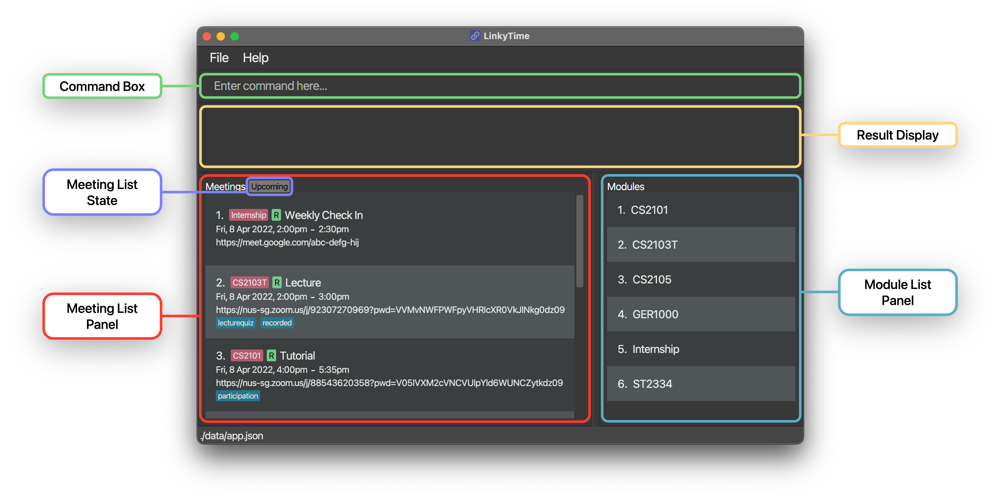
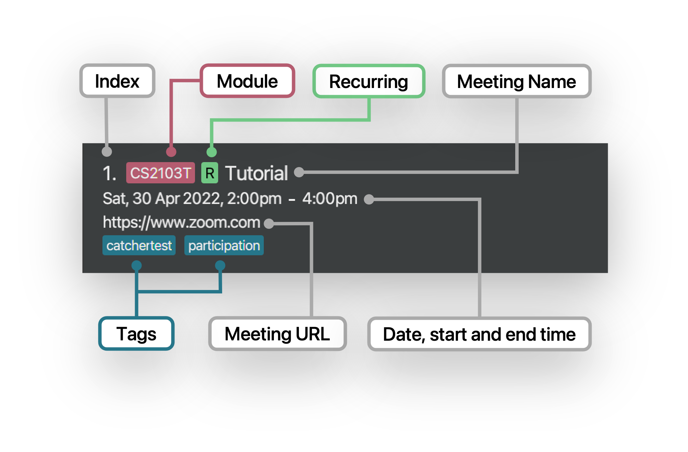
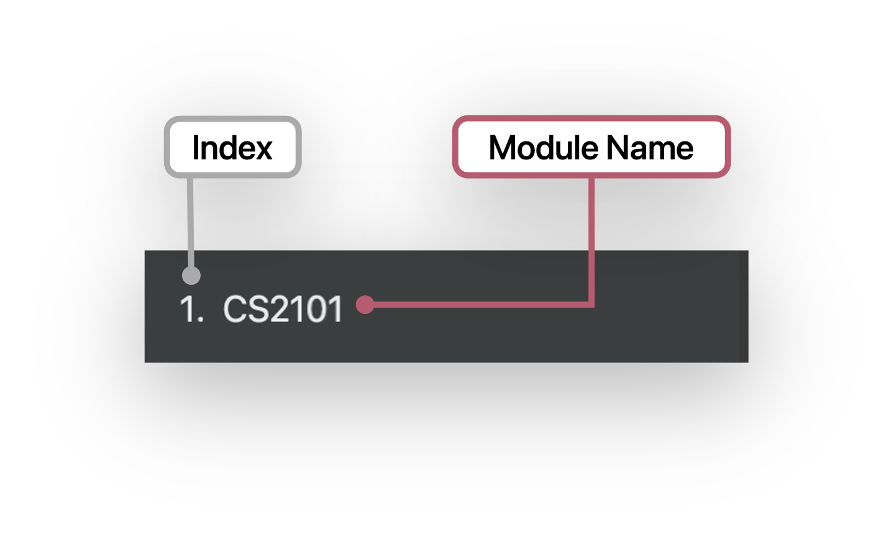

#### Table of Contents
* Table of Contents
{:toc}

--------------------------------------------------------------------------------------------------------------------

## Introduction

LinkyTime is a meetings link management system tailored for NUS students. It serves as a centralized platform for students to easily organize their online classes.

As NUS students, a common problem we face during this era of home-based learning is that the online lecture and tutorial links are disseminated across different platforms, such as via emails and LumiNUS. LinkyTime solves this problem by providing a platform for students to easily keep track of these meetings in one place.

The app is optimized for use via a Command-Line Interface while still having the benefits of a Graphical User Interface. 

If you're not familiar with using a Command-Line Interface, this User Guide can help you get up and running in no time.

<!-- If you can type fast,
LinkyTime can get your meeting management tasks done faster than traditional GUI apps. -->

### How to use the User Guide

You may refer to the [Table of Contents](#table-of-contents) to quickly navigate the User Guide.

The LinkyTime User Guide utilizes various visual cues to supplement the information presented. The following table provides an overview of all the typographical conventions used.

| Convention                                                                          | Description                                                      |
| ----------------------------------------------------------------------------------- | ---------------------------------------------------------------- |
| `Monospace`                                                                         | Command inputs and syntax, file paths.                           |
| [Hyperlink](#)                                                                      | Hyperlinks to external websites or within the user guide itself. |
| **Bold text**                                                                       | Important keywords to take note of.                              |
| **
 :information_source: Note 
** | Information of special interest or importance.                   |
| **
 :exclamation: Warning 
**  | Potentially irreversible action that may result in loss of data. |

## Graphical User Interface

LinkyTime's graphical user interface consists of 4 main components:

* Command Box
* Result Display
* Meeting List Panel
  * Meeting List State
* Module List Panel

You may type your commands in the **Command Box** and press Enter to execute it. The result message is displayed in the **Result Display** box.

Your meetings are displayed on the left in the **Meeting List Panel**, and your modules are displayed on the right in the **Module List Panel**.

At the top of the **Meeting List Panel**, the **Meeting List State** label indicates whether you are viewing your ongoing and upcoming meetings or your archived meetings.

### Meeting Card

Each meeting is displayed as shown in the example above.

### Module Card

Each module is displayed as shown in the example above.

--------------------------------------------------------------------------------------------------------------------

## Quick Start

1. Ensure you have [**Java 11**](https://www.openlogic.com/openjdk-downloads?field_java_parent_version_target_id=406&field_operating_system_target_id=All&field_architecture_target_id=All&field_java_package_target_id=401) or above installed in your computer.

2. Download the latest `linkytime.jar` from [here](https://github.com/AY2122S2-CS2103T-T13-3/tp/releases).

3. Copy the file to the folder you want to use as the **home folder** for the app.

4. Double-click the file to start the app. A GUI similar to the one shown below should appear in a few seconds. Note how
   the app contains some sample data. 

   
   
5. Type a command in the command box and press Enter to execute it. e.g. typing `list` and pressing Enter will list all upcoming meetings. 

   Some example commands you can try:

    * `list` : Lists all meetings.
    * `madd m/CS2105` : Adds a module called `CS2105` to the list of modules.
    * `add n/Tutorial u/https://www.zoom.com d/25-04-2022 1400 dur/2 m/1 r/Y t/Quiz` : Adds a meeting named `Tutorial` to the list of meetings.
    * `delete 3` : Deletes the 3rd meeting shown in the current list.
    * `exit` : Exits the app.

6. Refer to the [Features](#features) below for details of each command, or [Using LinkyTime](#using-linkytime) for how to set up for a new semester.

--------------------------------------------------------------------------------------------------------------------

## Using LinkyTime

Here are the steps to follow if you are using LinkyTime for the first time. You may refer to the [Features](#features) for additional details on the specific commands. Before following this guide, you may try the example commands in the [Quick Start](#quick-start) section on the sample data.

1. Run the `clear` command to clear the sample data.

2. Add all the modules that you are taking with the `madd` command.

3. Add your upcoming meetings for each module with the `add` command. Your meetings will be listed in chronological order, and will automatically be moved to your archive once they're over.

4. You can use the `list` or `archive` commands to view upcoming meetings or meetings that have passed respectively.

5. You can also use other commands such as `find` and `open` to help you search for and open your desired zoom meetings.

6. If you need to update a meeting information or remove a meeting, you can use the `edit` and `delete` commands.

7. If you need to update a module information or remove a module, use the `medit` or `mdelete` commands. Note that modules cannot be deleted if there are meetings assigned to it.

8. When you are done with LinkyTime, use the `exit` command to close the program.

9. If you need help at any time, you can access this User Guide using the `help` command and follow the link shown.

--------------------------------------------------------------------------------------------------------------------

## Command Format

The commands in this user guide follow this format:

* Words in `UPPER_CASE` are parameters that you can specify. 
  e.g. in `add n/MEETING_NAME`, `MEETING_NAME` is a parameter which can be specified, such as `add n/Lecture`.

* Items in square brackets are optional. 
  e.g. `n/MEETING_NAME [t/TAG]` can be used as `n/Lecture t/midterm` or as `n/Lecture`.

* Items with `…`​ after them can be used zero or more times. 
  e.g. `[t/TAG]…​` can be used as ` ` (i.e. 0 times), `t/recorded`, `t/recorded t/lecturequiz` etc.

* Parameters can be in any order. 
  e.g. if the command specifies `n/MEETING_NAME u/URL`, `u/URL n/MEETING_NAME` is also acceptable.

* If a parameter is expected only once in the command, but you specified it multiple times, only the last occurrence of the parameter will be taken. 
  e.g. if you specify `n/Lecture n/Tutorial`, only `n/Tutorial` will be taken.

* Extraneous parameters for commands that do not take in parameters (such as `help`, `list`, `exit` and `clear`) will be ignored. 
  e.g. if the command specifies `help 123`, it will be interpreted as `help`.

### Command Parameters

Most LinkyTime commands use various parameters. Their formats and constraints are provided in the table below.

| Parameter      | Prefix | Used in                           | Description                                                                                                                                                                                                                                                                                                                                                                                                                                                                                                   |
| -------------- | ------ | --------------------------------- |---------------------------------------------------------------------------------------------------------------------------------------------------------------------------------------------------------------------------------------------------------------------------------------------------------------------------------------------------------------------------------------------------------------------------------------------------------------------------------------------------------------|
| `MEETING_NAME` | `n/`   | `add` `edit`                      | The name of a meeting. {::nomarkdown}<ul><li> Accepts only alphanumeric characters and spaces. </li><li> Must not be blank. </li></ul>{:/}                                                                                                                                                                                                                                                                                                                                                                    |
| `MODULE_NAME`  | `n/`   | `madd` `medit`                    | The name of a module. {::nomarkdown}<ul><li> Must be unique. </li><li> Accepts only alphanumeric characters and spaces. </li><li> Must not be blank.</li></ul>{:/}                                                                                                                                                                                                                                                                                                                                            |
| `URL`          | `u/`   | `add` `edit`                      | The URL/link to a meeting. {::nomarkdown}<ul><li> Must include the full URL link, i.e. starts with {:/}`https://`{::nomarkdown}. </li><li> Must not be blank.</li></ul>{:/}                                                                                                                                                                                                                                                                                                                                   |
| `DATETIME`     | `d/`   | `add` `edit`                      | The date and time of a meeting. {::nomarkdown}<ul><li> Must be of the following format: {:/}`dd-MM-yyyy HHmm`{::nomarkdown}. </li><li> {:/}`dd` - 2 digit day, e.g. `01`, `28`{::nomarkdown}. </li><li> {:/}`MM` - 2 digit month, e.g. `01`, `12`{::nomarkdown}. </li><li> {:/}`yyyy` - 4 digit year, e.g. `2022`{::nomarkdown}. </li><li> {:/}`HHmm` - 24-hour time, e.g. `0800`, `1430`, `2359`{::nomarkdown}. </li><li> Must not be blank.</li></ul>{:/}                                                   |
| `DURATION`     | `dur/` | `add` `edit`                      | The duration of a meeting in hours. {::nomarkdown}<ul><li> Must be a decimal number greater than 1 minute and less than or equal to 24 hours, i.e. between {:/}`0.0167` to `24`{::nomarkdown}. </li><li> Accepts up to 4 decimal places. </li><li> Must not be blank.</li><li>{:/}For inputs such as `2` and `2.0001`, although LinkyTime will show them both as a 2 hour duration, they are in fact different.{::nomarkdown}</li></ul>{:/}|
| `MODULE_INDEX` | `m/`   | `add` `edit`                      | The index number of a module as shown in the displayed list. {::nomarkdown}<ul><li> Must be a positive integer, e.g. 1, 2, 3, ...  Must not be blank.</li></ul>{:/}                                                                                                                                                                                                                                                                                                                                           |
| `IS_RECURRING` | `r/`   | `add` `edit`                      | The recurrence of a meeting. If specified as `Y`, i.e. set to recur every week, the meeting will not expire and will be set to automatically repeat weekly. {::nomarkdown}<ul><li> Must be given as {:/}`Y` or `N`{::nomarkdown}. </li><li> Input is not case-sensitive. </li><li> Must not be blank.</li></ul>{:/}                                                                                                                                                                                           |
| `INDEX`        | -      | `edit` `delete` `medit` `mdelete` | The index number shown in the displayed list. {::nomarkdown}<ul><li> Must be a positive integer: 1, 2, 3...</li></ul>{:/}                                                                                                                                                                                                                                                                                                                                                                                     |
| `MODULE_INDEX` | `m/`   | `edit` `delete`                   | The module's index number shown in the displayed list. {::nomarkdown}<ul><li> Must be a positive integer: 1, 2, 3...</li></ul>{:/}                                                                                                                                                                                                                                                                                                                                                                            |
| `KEYWORD`      | -      | `find`                            | A keyword used in the find command. {::nomarkdown}<ul><li> Must be given as a single word without spaces. </li><li> Input is not case-sensitive.</li></ul>{:/}                                                                                                                                                                                                                                                                                                                                                |
| `TAG`          | `t/`   | `add` `edit`                      | The tag(s) assigned to a meeting. {::nomarkdown}<ul><li> Accepts only alphanumeric characters. </li><li> Spaces are not allowed.</li></ul>{:/}                                                                                                                                                                                                                                                                                                                                                                |

## Features

This section describes each of the commands and features available in LinkyTime.

### Meeting Management

:information_source: Meetings are always sorted in chronological order.  
Meeting list is only refreshed after every command.  
_Coming soon: Meeting list refreshes in real time_

#### Add a meeting : `add`

Adds a meeting into the meeting list.

Format: `add n/MEETING_NAME u/URL d/DATETIME dur/DURATION m/MODULE_INDEX r/IS_RECURRING [t/TAG]...`

Parameters:

* `MEETING_NAME` The name of the meeting.
* `URL` The URL to the online meeting.
* `DATETIME` The date and starting time of the meeting.
* `DURATION` The duration of the meeting in hours. Must be a decimal number between `0 < duration <= 24`. E.g., `2`, `1.5`.
* `MODULE_INDEX` The index of the module in the module list that the meeting is for.
* `IS_RECURRING` Whether the meeting recurs every week. Given as `Y` or `N`.
* `TAG` The tags associated with the meeting.

Examples:

* `add n/Lecture u/https://www.zoom.com d/25-04-2022 1400 dur/2 m/1 r/Y t/recorded t/lecturequiz` creates a meeting called `Lecture` with the tags `recorded` and `lecturequiz`, set to start on `25 April 2022 at 2pm` for `2` hours, and is assigned to the first module in the module list. This meeting is set to repeat weekly.
* `add n/Midterm u/https://meet.google.com d/13-05-2022 1000 dur/1.5 m/2 r/N` creates a meeting called `Midterm` on 13 May at 10am and is assigned to the second module in the module list.

#### List all meetings : `list`

View all recurring, ongoing, and upcoming meetings in the meeting list and display their respective details.

Format: `list`

Some details include:

* Meeting URL
* Meeting name
* Meeting date and time
* Module the meeting is assigned to

#### Find a meeting : `find`

Find meetings in the meeting list that matches the provided keywords and displays their respective details.

Format: `find KEYWORD [MORE_KEYWORDS]...`

* Displays all meetings with name, module code or tags that matches all of the provided keywords.

Examples:

* `find CS2101 Aaron` displays all meetings with fields that matches `CS2101` and `Aaron`.

#### Open a meeting URL : `open`

Opens a meeting URL link in the default web browser.

Format: `open INDEX`

* Opens the meeting at the specified `INDEX`.
* The index refers to the index number shown in the displayed meeting list.
* The index **must be a positive integer** 1, 2, 3, …​ that is within the range of the meeting list.

Examples:

* `list` followed by `open 2` opens the 2nd meeting's URL in the meeting list.

#### Edit a meeting : `edit`

Edits a meeting in the meeting list.

Format: `edit INDEX [n/MEETING_NAME] [u/URL] [d/DATETIME] [dur/DURATION] [m/MODULE_INDEX] [r/IS_RECURRING] [t/TAG]...`

* Edits the meeting at the specified `INDEX`. The index refers to the index number shown in the displayed meeting list. The index **must be a positive integer** 1, 2, 3, …​
* At least one of the optional fields must be provided.
* Existing values will be updated to the input values.
* When editing tags, the existing tags of the meeting will be removed, i.e., adding of tags is not cumulative.
* You can remove all the meeting’s tags by typing t/ without specifying any tags after it.

Examples:

* `edit 1 t/` removes all tags from the meeting at `INDEX` 1.
* `edit 2 n/Midterm` changes the name of the meeting at `INDEX` 2 to `Midterm`.
* `edit 3 n/Recitation dur/1 t/Optional t/Recorded` changes the name of the meeting at `INDEX` 3 to `Recitation`, duration of the meeting to 1 hour, and the tags to be `Optional` and `Recorded`.

#### Delete a meeting : `delete`

Deletes the specified meeting from the meeting list.

Format: `delete INDEX`

* Deletes the meeting at the specified `INDEX`.
* The index refers to the index number shown in the displayed meeting list.
* The index **must be a positive integer** 1, 2, 3, …​ that is within the range of the meeting list.

Examples:

* `list` followed by `delete 2` deletes the 2nd meeting in the meeting list.

#### List all archived meetings : `archive`

View all elapsed meetings in the meeting list and display their respective details.

Format: `archive`

### Module Management

:information_source: Modules are always sorted in case-insensitive alphabetical order.

#### Add a module : `madd`

Adds a module into the module list.

Format: `madd n/MODULE_NAME`

Parameters:

* `MODULE_NAME` The name or identifier of the module.

Examples:

* `madd n/CS2103T` creates a module named `CS2103T` in the module list.
* `madd n/Internship` creates a module named `Internship` in the module list.

#### Edit a module : `medit`

Edits the module specified in the module list.

Format: `medit INDEX n/MODULE_NAME`

* Edits the module at the specified `INDEX`.
* The index refers to the index number shown in the displayed module list.
* The index **must be a positive integer** 1, 2, 3, …​ that is within the range of the module list.
* The existing value will be updated to the input value.

Examples:

* `medit 1 n/CS2101` changes the name of the module at `INDEX` 1 to `CS2101`.
* `medit 2 n/Side Hustle` changes the name of the module at `INDEX` 2 to `Side Hustle`.

#### Delete a module : `mdelete`

Deletes the specified module from the module list.

Format: `mdelete INDEX [f/]`

* Deletes the module at the specified `INDEX`.
  * If there are meetings that are currently assigned to the specified module, deletion would fail due to dependent meetings.
* The index refers to the index number shown in the displayed module list.
* The index **must be a positive integer** 1, 2, 3, …​ that is within the range of the module list.
* Use the `f/` flag to force delete the module and all its associated meetings.

:exclamation: **Caution:** This action is irreversible, and it is not possible to recover any deleted meetings and module. 

Examples:

* `mdelete 2` deletes the 2nd module in the module list, provided there are no associated meetings.
* `mdelete 1 f/` deletes the 1st module in the module list and all associated meetings, if any.

### General

#### Viewing help : `help`

Shows a message explaining how to access the help page.

Format: `help`

#### Clearing all data : `clear`

Clears all meetings and modules from the application.

:exclamation: **Caution:**
This action is irreversible, and it is not possible to recover your data once it is cleared.

Format: `clear`

#### Exiting the program : `exit`

Exits the program.

Format: `exit`

#### Saving the data

Your meetings are saved to your computer automatically upon running any command that changes the data. There is no need to save manually.

#### Editing the data file

The meetings are saved in a JSON file at `[JAR file location]/data/app.json`. Advanced users are welcome to update their meetings directly by editing that file.

:exclamation: **Caution:**
If your changes to the data file makes its format invalid, LinkyTime will discard all data and start with an empty data file on the next run.

--------------------------------------------------------------------------------------------------------------------

## FAQ

**Q**: How do I transfer my data to another Computer? 
**A**: Install the app in the other computer and overwrite the empty `app.json` data file it creates with the
equivalent `app.json` data file from your previous LinkyTime installation.

--------------------------------------------------------------------------------------------------------------------

## Command summary

| Action                         | Format, Examples                                                                                                                                                                                         |
| ------------------------------ | -------------------------------------------------------------------------------------------------------------------------------------------------------------------------------------------------------- |
| **Add a meeting**              | `add n/MEETING_NAME u/URL d/DATETIME dur/DURATION m/MODULE_INDEX r/IS_RECURRING [t/TAG]...`   e.g., `add n/Lecture u/https://www.zoom.com d/25-03-2022 1400 dur/1.5 m/1 r/Y t/recorded t/lecturequiz` |
| **List all meetings**          | `list`                                                                                                                                                                                                   |
| **Find meetings**              | `find [keyword] [more keywords...]`   e.g., `find CS2103T lecture`                                                                                                                                    |
| **Open a meeting URL**         | `open INDEX`  e.g. `open 2`                                                                                                                                                                           |
| **Edit a meeting**             | `edit INDEX [n/MEETING_NAME] [u/URL] [d/DATETIME] [dur/DURATION] [m/MODULE_INDEX] [r/IS_RECURRING] [t/TAG]...`   e.g.,  `edit 1 n/Recitation dur/1`                                                   |
| **Delete a meeting**           | `delete INDEX`  e.g., `delete 3`                                                                                                                                                                      |
| **List all archived meetings** | `archive`                                                                                                                                                                                                |
| **Add a module**               | `madd n/MODULE_NAME`                                                                                                                                                                                     |
| **Edit a module**              | `medit INDEX n/MODULE_NAME`   e.g., `medit 1 n/CS2101`                                                                                                                                                |
| **Delete a module**            | `mdelete INDEX`  e.g., `mdelete 3`                                                                                                                                                                    |
| **Show help**                  | `help`                                                                                                                                                                                                   |
| **Clear all data**             | `clear`                                                                                                                                                                                                  |
| **Exit**                       | `exit`                                                                                                                                                                                                   |
